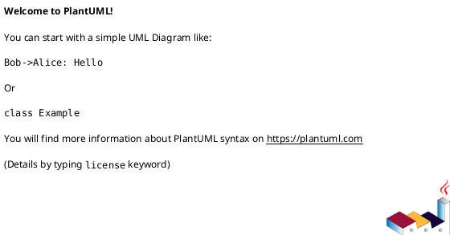

# Quick Start Guide

Get started viewing and working with the UML diagrams in minutes.

## 🚀 Fastest Way to View Diagrams (No Installation)

### Option 1: PlantUML Online Server (Recommended)

1. Go to [https://www.plantuml.com/plantuml/uml/](https://www.plantuml.com/plantuml/uml/)
2. Copy the content of any `.wsd` file
3. Paste it into the text area
4. View the rendered diagram instantly

**Example**: Try this with `src/Use_case.wsd` first!

### Option 2: PlantText

1. Go to [https://www.planttext.com/](https://www.planttext.com/)
2. Copy the content of any `.wsd` file
3. Paste and click "Refresh"

---

## 💻 Local Setup (For Frequent Use)

### Prerequisites
- Java 8+ (required by PlantUML)
- Graphviz (for better rendering)

### Installation

#### macOS
```bash
# Install Java if not already installed
brew install openjdk

# Install Graphviz
brew install graphviz

# Install PlantUML
brew install plantuml
```

#### Ubuntu/Debian
```bash
# Install Java
sudo apt-get update
sudo apt-get install default-jre

# Install Graphviz
sudo apt-get install graphviz

# Install PlantUML
sudo apt-get install plantuml
```

#### Windows
1. Install Java from [https://www.java.com/](https://www.java.com/)
2. Install Graphviz from [https://graphviz.org/download/](https://graphviz.org/download/)
3. Download PlantUML JAR from [https://plantuml.com/download](https://plantuml.com/download)

---

## 🎨 Editor Integration (Best Developer Experience)

### Visual Studio Code (Recommended)

1. **Install the Extension**:
   - Open VS Code
   - Go to Extensions (Ctrl+Shift+X / Cmd+Shift+X)
   - Search for "PlantUML"
   - Install "PlantUML" by jebbs

2. **View Diagrams**:
   - Open any `.wsd` file
   - Press `Alt+D` (or `Option+D` on Mac)
   - Preview appears on the side

3. **Export Diagrams**:
   - Right-click in the editor
   - Select "PlantUML: Export Current Diagram"
   - Choose format (PNG, SVG, PDF)

**VS Code Tips**:
- `Ctrl+Shift+V` (Cmd+Shift+V): Quick preview
- Split editor to see code and preview simultaneously

### IntelliJ IDEA / WebStorm / PyCharm

1. **Install Plugin**:
   - Go to Settings → Plugins
   - Search for "PlantUML integration"
   - Install and restart

2. **View Diagrams**:
   - Open any `.wsd` file
   - Preview automatically appears on the right
   - Or right-click → "PlantUML Preview"

### Vim / Neovim

1. **Install Plugin** (using vim-plug):
   ```vim
   Plug 'aklt/plantuml-syntax'
   Plug 'weirongxu/plantuml-previewer.vim'
   ```

2. **Preview**:
   - `:PlantumlOpen` - Open preview
   - `:PlantumlSave` - Export diagram

---

## 📁 Generate All Diagrams as Images

### Generate PNG Files
```bash
# Navigate to project root
cd /path/to/project

# Generate all diagrams as PNG
find src -name "*.wsd" -exec plantuml {} \;

# PNG files will be created next to .wsd files
```

### Generate SVG Files (Better for Web)
```bash
find src -name "*.wsd" -exec plantuml -tsvg {} \;
```

### Generate PDF Files
```bash
find src -name "*.wsd" -exec plantuml -tpdf {} \;
```

### Generate All Formats at Once
```bash
# Create output directory
mkdir -p exports/png exports/svg exports/pdf

# Generate PNG
find src -name "*.wsd" -exec plantuml -o ../../exports/png {} \;

# Generate SVG
find src -name "*.wsd" -exec plantuml -tsvg -o ../../exports/svg {} \;

# Generate PDF
find src -name "*.wsd" -exec plantuml -tpdf -o ../../exports/pdf {} \;
```

---

## 🔍 Where to Start?

### New to the Project?
1. **README.md** - Project overview and documentation
2. **DIAGRAM_INDEX.md** - Navigate all diagrams
3. **src/Use_case.wsd** - See what the system can do
4. **src/Class.wsd** - Understand the data model

### Want to Understand Architecture?
1. **src/Component.wsd** - Service architecture
2. **src/Package.wsd** - Code organization
3. **src/Deployment.wsd** - Deployment architecture

### Want to Understand User Flows?
1. **src/Activity/reading.wsd** - Reader journey
2. **src/Activity/author_workflow.wsd** - Author journey
3. **src/Sequence/authentication.wsd** - Login/register

### Want to Understand State Changes?
1. **src/State/States.wsd** - All entity lifecycles (Novel, Chapter, Review, Report, Subscription, Library)
2. **src/State/README.md** - Detailed documentation of state transitions

### Want to Implement a Feature?
1. Find the use case in **src/Use_case.wsd**
2. Check the corresponding sequence diagram in **src/Sequence/**
3. Check the activity workflow in **src/Activity/**
4. Check state transitions in **src/State/States.wsd**
5. Reference entities in **src/Class.wsd**

---

## 🛠️ Command-Line Usage

### View a Single Diagram
```bash
# Generate and open (macOS)
plantuml src/Class.wsd && open src/Class.png

# Generate and open (Linux)
plantuml src/Class.wsd && xdg-open src/Class.png

# Generate and open (Windows)
plantuml src/Class.wsd && start src/Class.png
```

### Watch Mode (Auto-regenerate on Save)
```bash
# Install inotifywait (Linux) or fswatch (macOS)
brew install fswatch  # macOS
sudo apt-get install inotify-tools  # Linux

# Watch and auto-regenerate (macOS)
fswatch -o src/**/*.wsd | xargs -n1 -I{} plantuml src/**/*.wsd

# Watch and auto-regenerate (Linux)
while inotifywait -e modify src/**/*.wsd; do plantuml src/**/*.wsd; done
```

---

## 📊 PlantUML Syntax Quick Reference

### Basic Structure


### Common Elements

#### Class Diagram
```plantuml
class ClassName {
    + publicAttribute : type
    - privateAttribute : type
    # protectedAttribute : type
    + publicMethod() : returnType
}

ClassA --|> ClassB : inheritance
ClassA *-- ClassB : composition
ClassA o-- ClassB : aggregation
ClassA --> ClassB : association
```

#### Sequence Diagram
```plantuml
actor User
participant System
database DB

User -> System : request()
activate System
System -> DB : query()
DB --> System : result
System --> User : response()
deactivate System
```

#### Activity Diagram
```plantuml
start
:Action;
if (condition?) then (yes)
    :Action A;
else (no)
    :Action B;
endif
stop
```

#### State Diagram
```plantuml
[*] --> StateA
StateA --> StateB : transition
StateB --> [*]
```

### Useful Tips
- Comments start with `'` (single quote)
- Use `note right`, `note left`, `note top`, `note bottom` for annotations
- Use `skinparam` for styling
- Use `header` and `footer` for titles

---

## 🎯 Recommended Workflow

### For Viewing
1. **Quick look**: Use online PlantUML server
2. **Regular work**: Install VS Code extension
3. **Presentations**: Export to SVG or PDF

### For Editing
1. **Small changes**: Edit in VS Code with preview
2. **Complex diagrams**: Use split view (code + preview)
3. **Testing**: Save and auto-preview

### For Collaboration
1. **Share diagrams**: Export to PNG/SVG
2. **Code review**: Review `.wsd` files in Git
3. **Documentation**: Link to rendered images in docs

---

## 🔗 Useful Resources

### Official Documentation
- **PlantUML Website**: [https://plantuml.com/](https://plantuml.com/)
- **Language Reference**: [https://plantuml.com/guide](https://plantuml.com/guide)
- **Class Diagram Guide**: [https://plantuml.com/class-diagram](https://plantuml.com/class-diagram)
- **Sequence Diagram Guide**: [https://plantuml.com/sequence-diagram](https://plantuml.com/sequence-diagram)
- **Activity Diagram Guide**: [https://plantuml.com/activity-diagram-beta](https://plantuml.com/activity-diagram-beta)
- **State Diagram Guide**: [https://plantuml.com/state-diagram](https://plantuml.com/state-diagram)

### Community Resources
- **PlantUML Reddit**: [r/PlantUML](https://www.reddit.com/r/plantuml/)
- **Stack Overflow**: Tag `plantuml`
- **GitHub Examples**: Search for `plantuml` topic

### Color Schemes
- **Skinparam Generator**: [https://plantuml-documentation.readthedocs.io/en/latest/formatting/all-skin-params.html](https://plantuml-documentation.readthedocs.io/en/latest/formatting/all-skin-params.html)

---

## ❓ Troubleshooting

### "Command not found: plantuml"
- **Solution**: Install PlantUML using the installation instructions above
- **Verify**: Run `java -version` to ensure Java is installed

### Diagram doesn't render properly
- **Solution 1**: Install Graphviz for better rendering
- **Solution 2**: Try online PlantUML server
- **Solution 3**: Check for syntax errors in the `.wsd` file

### VS Code preview not working
- **Solution 1**: Install Java and Graphviz
- **Solution 2**: Reload VS Code window (Cmd+Shift+P → "Reload Window")
- **Solution 3**: Check PlantUML extension settings

### Images are low quality
- **Solution**: Export as SVG instead of PNG
  ```bash
  plantuml -tsvg src/Class.wsd
  ```

### Diagram is too large
- **Solution**: Use `scale` directive
  ```plantuml
  @startuml
  scale 0.7
  ' Your diagram
  @enduml
  ```

---

## 💡 Pro Tips

1. **Use keyboard shortcuts**: Learn your editor's PlantUML shortcuts
2. **Split view**: Keep code and preview side-by-side
3. **Version control**: Commit `.wsd` files, ignore generated images (see `.gitignore`)
4. **Export for presentations**: SVG scales perfectly for slides
5. **Link diagrams**: Reference other diagrams in notes
6. **Keep it simple**: Break complex diagrams into multiple files
7. **Consistent naming**: Use clear, descriptive diagram names
8. **Add notes**: Explain complex parts with `note` elements

---

## 🎓 Next Steps

After viewing the diagrams:

1. **Read README.md** for complete documentation
2. **Check DIAGRAM_INDEX.md** to navigate all diagrams
3. **Review COHERENCE_VALIDATION.md** to understand diagram relationships
4. **Start implementing** based on the UML specifications

---

**Happy Diagramming! 🎨**

For questions or issues, please refer to the PlantUML documentation or create an issue in this repository.
